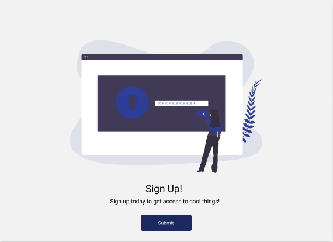
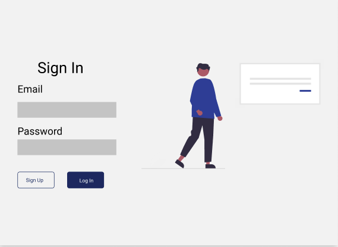

## Description:

Used Figma to design a signin and signup modal. Coded the design and added animation using react-spring, css-in-js and installed storybook to document components from Frontend Masters' Design Systems with React and Storybook course (https://frontendmasters.com/courses/design-systems/).

## Design Tool: 

* Figma
* styled-components & polished

## Libraries: 

* react-spring
* storybook 

